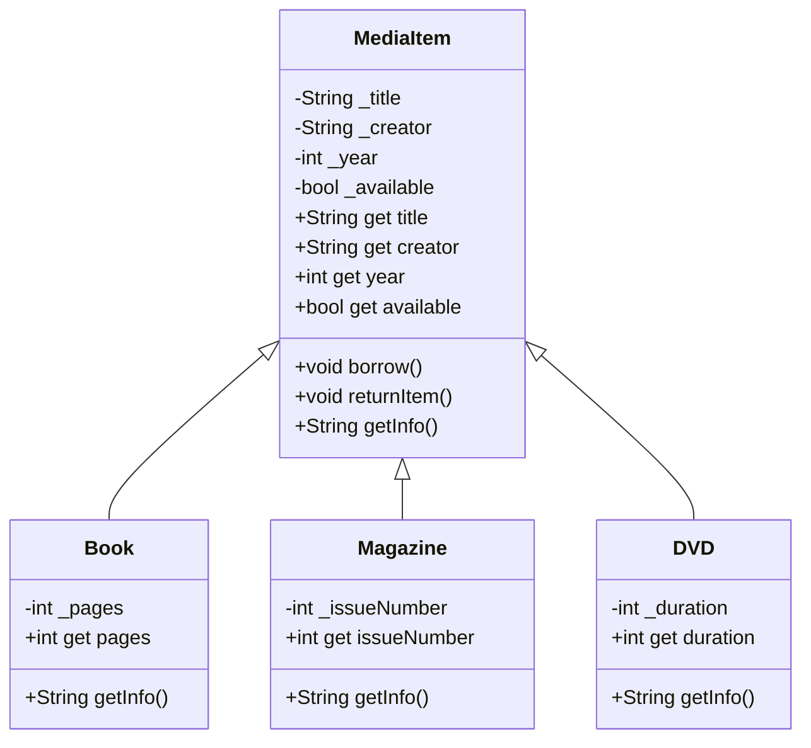

# 🔄 FASE 2: Herència i Polimorfisme

## 📌 Objectius de la Fase

En aquesta fase aprendràs a reutilitzar codi i crear jerarquies de classes:

- Comprendre la relació d'herència entre classes
- Evitar duplicació de codi mitjançant classes base
- Aplicar polimorfisme per tractar objectes de forma uniforme
- Sobreescriure mètodes per comportaments específics

!!! info "Durada estimada"
    **12 hores** distribuïdes en sessions teòriques i pràctiques

---

## 📚 Lliçó 2: Herència - Especialització de Classes

### 🎯 Objectius d'Aprenentatge

Al finalitzar aquesta lliçó seràs capaç de:

- Crear jerarquies de classes amb herència
- Utilitzar la paraula clau `extends`
- Cridar el constructor de la classe pare amb `super()`
- Sobreescriure mètodes amb `@override`
- Identificar relacions "és un" (is-a)

---

### 📖 Context: Sistema de Biblioteca

Desenvoluparem un sistema per gestionar diferents tipus de materials en una biblioteca: llibres, revistes i DVDs.

---

### 🔴 Problema: Codi Duplicat

#### Versió sense herència

```dart
class Book {
  String title;
  String author;
  int year;
  bool available;
  int pages;
  
  Book(this.title, this.author, this.year, this.pages) 
      : available = true;
  
  void borrow() {
    if (available) {
      available = false;
      print('Has agafat: $title');
    } else {
      print('No disponible: $title');
    }
  }
  
  void returnItem() {
    available = true;
    print('Has retornat: $title');
  }
}

class Magazine {
  String title;
  String publisher; // Editorial
  int year;
  bool available;
  int issueNumber;
  
  Magazine(this.title, this.publisher, this.year, this.issueNumber) 
      : available = true;
  
  void borrow() {
    if (available) {
      available = false;
      print('Has agafat: $title');
    } else {
      print('No disponible: $title');
    }
  }
  
  void returnItem() {
    available = true;
    print('Has retornat: $title');
  }
}

class DVD {
  String title;
  String director;
  int year;
  bool available;
  int duration; // en minuts
  
  DVD(this.title, this.director, this.year, this.duration) 
      : available = true;
  
  void borrow() {
    if (available) {
      available = false;
      print('Has agafat: $title');
    } else {
      print('No disponible: $title');
    }
  }
  
  void returnItem() {
    available = true;
    print('Has retornat: $title');
  }
}
```

!!! danger "Problemes detectats"
    **Codi Repetit:**
    
    - `title`, `year`, `available` són iguals a totes les classes
    - `borrow()` i `returnItem()` són idèntics
    - Si cal canviar la lògica de préstec → cal modificar 3 llocs! 😱
    
    **Dificultat de manteniment:**
    
    - Més classes → més duplicació
    - Risc d'inconsistències
    - Molt codi per mantenir

---

### ✅ Solució: Herència

!!! info "Concepte d'Herència"
    L'**herència** permet crear una nova classe basada en una classe existent.
    
    - **Classe base** (superclasse, pare): Conté propietats i mètodes comuns
    - **Classe derivada** (subclasse, filla): Hereta de la base i afegeix característiques específiques
    
    **Relació "és un" (is-a):**
    
    - Un Llibre **és un** MediaItem
    - Una Revista **és un** MediaItem
    - Un DVD **és un** MediaItem

---

### 💻 Implementació amb Herència

#### Classe Base: MediaItem

```dart
class MediaItem {
  // Propietats COMUNES a tots els tipus
  String _title;
  String _creator; // autor, director, editorial...
  int _year;
  bool _available;
  
  // Constructor de la classe base
  MediaItem(this._title, this._creator, this._year) 
      : _available = true;
  
  // Getters
  String get title => _title;
  String get creator => _creator;
  int get year => _year;
  bool get available => _available;
  
  // Mètodes COMUNS
  void borrow() {
    if (_available) {
      _available = false;
      print('✓ Has agafat: $_title');
    } else {
      print('✗ No disponible: $_title');
    }
  }
  
  void returnItem() {
    _available = true;
    print('✓ Has retornat: $_title');
  }
  
  // Mètode que les subclasses poden sobreescriure
  String getInfo() {
    return '$_title ($_year) - $_creator';
  }
}
```

---

#### Classes Derivades

```dart
// Book HERETA de MediaItem
class Book extends MediaItem {
  int _pages;
  
  // Constructor: crida super() per inicialitzar la classe base
  Book(String title, String author, int year, this._pages) 
      : super(title, author, year);
  
  int get pages => _pages;
  
  // SOBREESCRIURE mètode de la classe base
  @override
  String getInfo() {
    return 'LLIBRE: ${super.getInfo()} - $_pages pàgines';
  }
}

class Magazine extends MediaItem {
  int _issueNumber;
  
  Magazine(String title, String publisher, int year, this._issueNumber) 
      : super(title, publisher, year);
  
  int get issueNumber => _issueNumber;
  
  @override
  String getInfo() {
    return 'REVISTA: ${super.getInfo()} - Núm. $_issueNumber';
  }
}

class DVD extends MediaItem {
  int _duration; // minuts
  
  DVD(String title, String director, int year, this._duration) 
      : super(title, director, year);
  
  int get duration => _duration;
  
  @override
  String getInfo() {
    return 'DVD: ${super.getInfo()} - $_duration min';
  }
}
```

!!! success "Avantatges de l'Herència"
    ✅ **Reutilització**: Codi comú només es defineix un cop
    
    ✅ **Mantenibilitat**: Canvis a la lògica comú es fan en un sol lloc
    
    ✅ **Extensibilitat**: Fàcil afegir nous tipus de MediaItem
    
    ✅ **Organització**: Jerarquia clara i lògica

---

### 🔑 Conceptes Clau

!!! info "Paraula clau `extends`"
    ```dart
    class Book extends MediaItem { }
    ```
    
    - `Book` hereta totes les propietats i mètodes de `MediaItem`
    - `Book` pot afegir propietats i mètodes addicionals
    - `Book` pot sobreescriure mètodes existents

!!! info "Constructor amb `super()`"
    ```dart
    Book(String title, String author, int year, this._pages) 
        : super(title, author, year);
    ```
    
    - `super()` crida el constructor de la classe base
    - S'executa ABANS del constructor de la classe derivada
    - Obligatori si el constructor de la base té paràmetres

!!! info "Sobreescriptura amb `@override`"
    ```dart
    @override
    String getInfo() {
      return 'LLIBRE: ${super.getInfo()} - $_pages pàgines';
    }
    ```
    
    - `@override` indica que sobreescrivim un mètode de la base
    - `super.getInfo()` crida la versió original del mètode
    - Podem combinar comportament base + específic

---

### 📝 Programa d'Exemple

```dart
void main() {
  // Crear objectes de diferents tipus
  Book book1 = Book('El Quixot', 'Cervantes', 1605, 863);
  Magazine mag1 = Magazine('National Geographic', 'NatGeo', 2024, 345);
  DVD dvd1 = DVD('Inception', 'Nolan', 2010, 148);
  
  // Tots tenen els mètodes heretats
  print('=== PRÉSTECS ===');
  book1.borrow();
  mag1.borrow();
  dvd1.borrow();
  
  // Intentar agafar el mateix llibre
  book1.borrow(); // No disponible
  
  // Retornar
  print('\n=== RETORNS ===');
  book1.returnItem();
  
  // Informació específica de cada tipus
  print('\n=== INFORMACIÓ ===');
  print(book1.getInfo());
  print(mag1.getInfo());
  print(dvd1.getInfo());
}
```

!!! example "Sortida"
    ```
    === PRÉSTECS ===
    ✓ Has agafat: El Quixot
    ✓ Has agafat: National Geographic
    ✓ Has agafat: Inception
    ✗ No disponible: El Quixot
    
    === RETORNS ===
    ✓ Has retornat: El Quixot
    
    === INFORMACIÓ ===
    LLIBRE: El Quixot (1605) - Cervantes - 863 pàgines
    REVISTA: National Geographic (2024) - NatGeo - Núm. 345
    DVD: Inception (2010) - Nolan - 148 min
    ```

---

## 📚 Lliçó 3: Polimorfisme - Múltiples Formes

### 🎯 Objectius d'Aprenentatge

Al finalitzar aquesta lliçó seràs capaç de:

- Tractar objectes de diferents classes de forma uniforme
- Utilitzar llistes heterogènies amb tipus base
- Implementar comportaments polimòrfics
- Comprendre crida dinàmica de mètodes

---

### 📖 Context: Càlcul de Preus de Lloguer

Cada tipus de material té un preu de lloguer diferent:

- **Llibres**: 1€ per dia
- **Revistes**: 0.50€ (preu fix)
- **DVDs**: 2€ per dia + 1€ de recàrrec

---

### 💻 Implementació Polimòrfica

#### Afegir mètode a la classe base

```dart
class MediaItem {
  String _title;
  String _creator;
  int _year;
  bool _available;
  
  MediaItem(this._title, this._creator, this._year) 
      : _available = true;
  
  // ... (getters i altres mètodes)
  
  // Mètode polimòrfic: cada subclasse ho implementa diferent
  double calculateRentalPrice(int days) {
    return 0.0; // Valor per defecte
  }
  
  String getInfo() {
    return '$_title ($_year) - $_creator';
  }
  
  void borrow() {
    if (_available) {
      _available = false;
      print('✓ Has agafat: $_title');
    } else {
      print('✗ No disponible: $_title');
    }
  }
  
  void returnItem() {
    _available = true;
    print('✓ Has retornat: $_title');
  }
}
```

---

#### Sobreescriure en cada subclasse

```dart
class Book extends MediaItem {
  int _pages;
  
  Book(String title, String author, int year, this._pages) 
      : super(title, author, year);
  
  int get pages => _pages;
  
  @override
  double calculateRentalPrice(int days) {
    return days * 1.0; // 1€ per dia
  }
  
  @override
  String getInfo() {
    return 'LLIBRE: ${super.getInfo()} - $_pages pàgines';
  }
}

class Magazine extends MediaItem {
  int _issueNumber;
  
  Magazine(String title, String publisher, int year, this._issueNumber) 
      : super(title, publisher, year);
  
  int get issueNumber => _issueNumber;
  
  @override
  double calculateRentalPrice(int days) {
    return 0.50; // Preu fix
  }
  
  @override
  String getInfo() {
    return 'REVISTA: ${super.getInfo()} - Núm. $_issueNumber';
  }
}

class DVD extends MediaItem {
  int _duration;
  
  DVD(String title, String director, int year, this._duration) 
      : super(title, director, year);
  
  int get duration => _duration;
  
  @override
  double calculateRentalPrice(int days) {
    return (days * 2.0) + 1.0; // 2€ per dia + recàrrec d'1€
  }
  
  @override
  String getInfo() {
    return 'DVD: ${super.getInfo()} - $_duration min';
  }
}
```

---

### 🎭 Polimorfisme en Acció

!!! info "Què és el Polimorfisme?"
    El **polimorfisme** permet tractar objectes de diferents classes derivades com si fossin del tipus base, però cada objecte executa la seva pròpia versió dels mètodes.
    
    **"Mateix mètode, diferent comportament"**

```dart
void main() {
  // Llista HETEROGÈNIA: diferents tipus, mateixa base
  List<MediaItem> library = [
    Book('1984', 'Orwell', 1949, 328),
    Magazine('Vogue', 'Condé Nast', 2024, 567),
    DVD('Matrix', 'Wachowski', 1999, 136),
    Book('Dune', 'Herbert', 1965, 688),
    DVD('Interstellar', 'Nolan', 2014, 169),
  ];
  
  // Tractar tots els elements de FORMA UNIFORME
  print('=== INVENTARI DE LA BIBLIOTECA ===');
  for (MediaItem item in library) {
    print(item.getInfo());
  }
  
  // POLIMORFISME: cada objecte executa la seva versió
  print('\n=== PREUS DE LLOGUER (7 dies) ===');
  for (MediaItem item in library) {
    double price = item.calculateRentalPrice(7);
    print('${item.title}: ${price.toStringAsFixed(2)}€');
  }
  
  // Calcular preu total
  double totalPrice = 0;
  for (MediaItem item in library) {
    totalPrice += item.calculateRentalPrice(7);
  }
  print('\nPreu total lloguer 7 dies: ${totalPrice.toStringAsFixed(2)}€');
}
```

!!! example "Sortida"
    ```
    === INVENTARI DE LA BIBLIOTECA ===
    LLIBRE: 1984 (1949) - Orwell - 328 pàgines
    REVISTA: Vogue (2024) - Condé Nast - Núm. 567
    DVD: Matrix (1999) - Wachowski - 136 min
    LLIBRE: Dune (1965) - Herbert - 688 pàgines
    DVD: Interstellar (2014) - Nolan - 169 min
    
    === PREUS DE LLOGUER (7 dies) ===
    1984: 7.00€
    Vogue: 0.50€
    Matrix: 15.00€
    Dune: 7.00€
    Interstellar: 15.00€
    
    Preu total lloguer 7 dies: 44.50€
    ```

!!! success "Màgia del Polimorfisme"
    Observa que:
    
    - Utilitzem `List<MediaItem>` per tots els tipus
    - Cridem `calculateRentalPrice()` sense saber el tipus exacte
    - Cada objecte executa **la seva pròpia versió**
    - El mateix bucle funciona per tots els tipus!

---

### Diagrama de Classes en UML


<div style="display: flex; justify-content: center;">
  <div style="width: 70%; font-size: 0.8em;">



  </div>
</div>

### 🔑 Conceptes Clau del Polimorfisme

!!! info "Tipus en Temps de Compilació vs Execució"
    ```dart
    MediaItem item = Book('1984', 'Orwell', 1949, 328);
    ```
    
    - **Temps de compilació**: `item` és de tipus `MediaItem`
    - **Temps d'execució**: `item` apunta a un objecte `Book`
    - En cridar `item.calculateRentalPrice()` → s'executa la versió de `Book`

!!! info "Crida Dinàmica de Mètodes (Dynamic Dispatch)"
    El sistema decideix en **temps d'execució** quina versió del mètode cridar segons el tipus real de l'objecte.
    
    ```dart
    for (MediaItem item in library) {
      item.calculateRentalPrice(7); // Decideix en runtime
    }
    ```

---

## 🎯 Exercicis Pràctics

### Exercici 1: Afegir Audiobook

!!! question "Enunciat"
    Crea una classe `AudioBook` que hereti de `MediaItem`.
    
    **Propietats específiques:**
    
    - `duration` (int): duració en minuts
    - `narrator` (String): narrador
    
    **Preu de lloguer:**
    
    - 1.50€ per dia
    
    **Mètode `getInfo()`:**
    
    - Ha de mostrar: "AUDIOBOOK: [info base] - [duration] min - Narrat per [narrator]"

??? example "Solució"
    ```dart
    class AudioBook extends MediaItem {
      int _duration;
      String _narrator;
      
      AudioBook(String title, String author, int year, 
                this._duration, this._narrator) 
          : super(title, author, year);
      
      int get duration => _duration;
      String get narrator => _narrator;
      
      @override
      double calculateRentalPrice(int days) {
        return days * 1.50;
      }
      
      @override
      String getInfo() {
        return 'AUDIOBOOK: ${super.getInfo()} - $_duration min - '
               'Narrat per $_narrator';
      }
    }
    
    // Ús:
    void main() {
      AudioBook audio = AudioBook(
        'Harry Potter', 
        'J.K. Rowling', 
        1997, 
        540, 
        'Stephen Fry'
      );
      
      print(audio.getInfo());
      print('Preu 5 dies: ${audio.calculateRentalPrice(5)}€');
    }
    ```

---

### Exercici 2: Gestor de Biblioteca

!!! question "Enunciat"
    Crea una classe `Library` que gestioni una col·lecció de `MediaItem`.
    
    **Mètodes a implementar:**
    
    - `addItem(MediaItem item)`: afegir item
    - `displayInventory()`: mostrar tots els items
    - `calculateTotalRentalPrice(int days)`: preu total de lloguer
    - `getItemsByType(Type type)`: filtrar per tipus (Book, DVD, etc.)
    - `getTotalItems()`: nombre total d'items

??? example "Solució"
    ```dart
    class Library {
      List<MediaItem> _items = [];
      
      void addItem(MediaItem item) {
        _items.add(item);
        print('✓ Afegit: ${item.title}');
      }
      
      void displayInventory() {
        if (_items.isEmpty) {
          print('La biblioteca està buida');
          return;
        }
        
        print('=== INVENTARI (${_items.length} items) ===');
        for (int i = 0; i < _items.length; i++) {
          print('${i + 1}. ${_items[i].getInfo()}');
        }
      }
      
      double calculateTotalRentalPrice(int days) {
        double total = 0;
        for (MediaItem item in _items) {
          total += item.calculateRentalPrice(days);
        }
        return total;
      }
      
      List<MediaItem> getItemsByType(Type type) {
        return _items.where((item) => item.runtimeType == type).toList();
      }
      
      int getTotalItems() => _items.length;
    }
    
    // Ús:
    void main() {
      Library lib = Library();
      
      lib.addItem(Book('1984', 'Orwell', 1949, 328));
      lib.addItem(DVD('Matrix', 'Wachowski', 1999, 136));
      lib.addItem(Magazine('Vogue', 'Condé Nast', 2024, 567));
      
      lib.displayInventory();
      
      print('\nPreu total 7 dies: ${lib.calculateTotalRentalPrice(7)}€');
      
      print('\n=== NOMÉS LLIBRES ===');
      List<MediaItem> books = lib.getItemsByType(Book);
      for (MediaItem book in books) {
        print(book.getInfo());
      }
    }
    ```

---

### Exercici 3: Descomptes Especials

!!! question "Enunciat"
    Afegeix un mètode `calculateDiscountedPrice(int days, double discountPercent)` a `MediaItem` que calcula el preu amb descompte.
    
    Sobreescriu-lo a `Book` per aplicar un 10% de descompte addicional si es lloga més de 7 dies.

??? example "Solució"
    ```dart
    class MediaItem {
      // ... (propietats i mètodes existents)
      
      double calculateDiscountedPrice(int days, double discountPercent) {
        double price = calculateRentalPrice(days);
        return price * (1 - discountPercent / 100);
      }
    }
    
    class Book extends MediaItem {
      int _pages;
      
      Book(String title, String author, int year, this._pages) 
          : super(title, author, year);
      
      int get pages => _pages;
      
      @override
      double calculateRentalPrice(int days) {
        return days * 1.0;
      }
      
      @override
      double calculateDiscountedPrice(int days, double discountPercent) {
        double price = calculateRentalPrice(days);
        double discount = discountPercent;
        
        // Descompte addicional si > 7 dies
        if (days > 7) {
          discount += 10;
        }
        
        return price * (1 - discount / 100);
      }
      
      @override
      String getInfo() {
        return 'LLIBRE: ${super.getInfo()} - $_pages pàgines';
      }
    }
    
    // Ús:
    void main() {
      Book book = Book('Dune', 'Herbert', 1965, 688);
      
      print('Preu 5 dies: ${book.calculateRentalPrice(5)}€');
      print('Amb 20% desc.: ${book.calculateDiscountedPrice(5, 20)}€');
      
      print('\nPreu 10 dies: ${book.calculateRentalPrice(10)}€');
      print('Amb 20% desc. + 10% extra: '
            '${book.calculateDiscountedPrice(10, 20)}€');
      // 20% + 10% = 30% total
    }
    ```

---

## 📝 Resum de Conceptes

!!! abstract "Herència"
    **Definició:** Crear classes noves basades en classes existents
    
    **Sintaxi:** `class Filla extends Pare { }`
    
    **Beneficis:**
    
    - Reutilització de codi
    - Evita duplicació
    - Jerarquies lògiques
    - Fàcil manteniment
    
    **Relació:** "és un" (is-a)

!!! abstract "Polimorfisme"
    **Definició:** Tractar objectes de diferents tipus de forma uniforme
    
    **Característiques:**
    
    - Mateix mètode, diferent comportament
    - Crida dinàmica en runtime
    - Llistes heterogènies
    
    **Beneficis:**
    
    - Codi més flexible
    - Fàcil extensió
    - Menys condicionals

!!! abstract "Sobreescriptura"
    **Sintaxi:** `@override`
    
    **Ús:** Redefinir mètodes heretats
    
    **`super`:** Accedir a la versió del pare

---

## ✍️ Autoavaluació FASE 2

### Pregunta 1: Conceptes d'Herència

!!! question "Comprensió teòrica"
    **a)** Explica amb les teves paraules què és l'herència.
    
    **b)** Quina diferència hi ha entre una classe base i una classe derivada?
    
    **c)** Quan utilitzaries herència? Dona un exemple del món real.

??? success "Resposta esperada"
    **a)** L'herència és un mecanisme que permet crear una nova classe basada en una classe existent, heretant les seves propietats i mètodes, i podent afegir noves característiques o modificar les existents.
    
    **b)** La classe base (o pare) conté les propietats i mètodes comuns, mentre que les classes derivades (o filles) hereten d'aquesta base i afegeixen característiques específiques.
    
    **c)** Utilitzaria herència quan:
    
    - Hi ha codi duplicat entre classes
    - Existeix una relació "és un" clara
    - Exemple: `Vehicle` (base) → `Cotxe`, `Moto`, `Camió` (derivades)

---

### Pregunta 2: super() i @override

!!! question "Sintaxi i ús"
    **a)** Per què utilitzem `super()` al constructor?
    
    **b)** Què significa `@override`?
    
    **c)** Es pot cridar `super.metode()` dins d'un mètode sobreescrit?

??? success "Resposta esperada"
    **a)** `super()` crida el constructor de la classe base per inicialitzar les propietats heretades. És obligatori si el constructor del pare té paràmetres.
    
    **b)** `@override` indica que estem sobreescrivint (redefinint) un mètode que ja existeix a la classe base. Ajuda a detectar errors.
    
    **c)** Sí! És una pràctica habitual per reutilitzar la funcionalitat de la base i afegir comportament addicional:
    ```dart
    @override
    String getInfo() {
      return 'LLIBRE: ${super.getInfo()} - $_pages pàgines';
    }
    ```

---

### Pregunta 3: Polimorfisme

!!! question "Comprensió pràctica"
    Observa aquest codi:
    
    ```dart
    List<MediaItem> items = [
      Book('1984', 'Orwell', 1949, 328),
      DVD('Matrix', 'Wachowski', 1999, 136),
    ];
    
    for (MediaItem item in items) {
      print(item.calculateRentalPrice(7));
    }
    ```
    
    **a)** Per què podem posar `Book` i `DVD` en una llista de `MediaItem`?
    
    **b)** Com sap el sistema quina versió de `calculateRentalPrice()` cridar?
    
    **c)** Això és polimorfisme? Per què?

??? success "Resposta esperada"
    **a)** Perquè tant `Book` com `DVD` hereten de `MediaItem`, per tant són subtipus compatibles. Relació "és un": un Book **és un** MediaItem.
    
    **b)** Mitjançant **crida dinàmica** (dynamic dispatch): el sistema decideix en temps d'execució quin mètode cridar segons el tipus real de l'objecte.
    
    **c)** Sí, és polimorfisme perquè:
    
    - Tractem objectes de diferents tipus de forma uniforme
    - Cridem el mateix mètode per tots
    - Cada objecte executa la seva pròpia versió
    - "Mateix mètode, diferent comportament"

---

### Pregunta 4: Identificar Errors

!!! question "Debugging"
    Troba i corregeix els errors en aquest codi:
    
    ```dart
    class Animal {
      String name;
      
      Animal(this.name);
      
      void makeSound() {
        print('Some sound');
      }
    }
    
    class Dog {
      String breed;
      
      Dog(String name, this.breed);
      
      void makeSound() {
        print('Woof!');
      }
    }
    
    void main() {
      List<Animal> animals = [
        Animal('Generic'),
        Dog('Rex', 'Labrador'),
      ];
      
      for (Animal a in animals) {
        a.makeSound();
      }
    }
    ```

??? success "Resposta esperada"
    **Errors detectats:**
    
    1. `Dog` no hereta d'`Animal` (falta `extends`)
    2. `Dog` no crida `super(name)` al constructor
    3. Falta `@override` a `makeSound()` de `Dog`
    
    **Versió correcta:**
    ```dart
    class Animal {
      String name;
      
      Animal(this.name);
      
      void makeSound() {
        print('Some sound');
      }
    }
    
    class Dog extends Animal {  // ← extends Animal
      String breed;
      
      Dog(String name, this.breed) : super(name);  // ← super(name)
      
      @override  // ← @override
      void makeSound() {
        print('Woof!');
      }
    }
    
    void main() {
      List<Animal> animals = [
        Animal('Generic'),
        Dog('Rex', 'Labrador'),
      ];
      
      for (Animal a in animals) {
        a.makeSound();
      }
    }
    ```

---

### Pregunta 5: Disseny de Jerarquia

!!! question "Pràctica"
    Dissenya una jerarquia de classes per a un sistema de vehicles:
    
    **Requisits:**
    
    - Classe base: `Vehicle`
    - Classes derivades: `Car`, `Motorcycle`, `Truck`
    - Propietats comunes: marca, model, any, preu
    - Propietats específiques:
        - Car: nombre de portes
        - Motorcycle: cilindrada
        - Truck: capacitat de càrrega
    - Mètode polimòrfic: `calculateTax()` diferent per cada tipus

??? example "Solució"
    ```dart
    class Vehicle {
      String _brand;
      String _model;
      int _year;
      double _price;
      
      Vehicle(this._brand, this._model, this._year, this._price);
      
      String get brand => _brand;
      String get model => _model;
      int get year => _year;
      double get price => _price;
      
      double calculateTax() {
        return 0.0; // Base
      }
      
      String getInfo() {
        return '$_brand $_model ($_year) - $_price€';
      }
    }
    
    class Car extends Vehicle {
      int _doors;
      
      Car(String brand, String model, int year, double price, this._doors) 
          : super(brand, model, year, price);
      
      int get doors => _doors;
      
      @override
      double calculateTax() {
        return price * 0.15; // 15% per cotxes
      }
      
      @override
      String getInfo() {
        return 'COTXE: ${super.getInfo()} - $_doors portes';
      }
    }
    
    class Motorcycle extends Vehicle {
      int _cc; // cilindrada
      
      Motorcycle(String brand, String model, int year, double price, this._cc) 
          : super(brand, model, year, price);
      
      int get cc => _cc;
      
      @override
      double calculateTax() {
        return price * 0.08; // 8% per motos
      }
      
      @override
      String getInfo() {
        return 'MOTO: ${super.getInfo()} - $_cc cc';
      }
    }
    
    class Truck extends Vehicle {
      double _loadCapacity; // kg
      
      Truck(String brand, String model, int year, double price, this._loadCapacity) 
          : super(brand, model, year, price);
      
      double get loadCapacity => _loadCapacity;
      
      @override
      double calculateTax() {
        return price * 0.20; // 20% per camions
      }
      
      @override
      String getInfo() {
        return 'CAMIÓ: ${super.getInfo()} - $_loadCapacity kg';
      }
    }
    
    // Ús:
    void main() {
      List<Vehicle> vehicles = [
        Car('Toyota', 'Corolla', 2023, 25000, 4),
        Motorcycle('Yamaha', 'R1', 2024, 18000, 998),
        Truck('Volvo', 'FH16', 2022, 85000, 25000),
      ];
      
      for (Vehicle v in vehicles) {
        print(v.getInfo());
        print('Impost: ${v.calculateTax().toStringAsFixed(2)}€\n');
      }
    }
    ```

---

### ✅ Checklist d'Autoavaluació

Marca els conceptes que domines:

- [ ] Sé crear una classe que hereta d'una altra amb `extends`
- [ ] Utilitzo `super()` correctament al constructor
- [ ] Sobreescric mètodes amb `@override`
- [ ] Entenc la diferència entre classe base i derivada
- [ ] Puc cridar mètodes de la classe base amb `super.metode()`
- [ ] Comprenc el concepte de polimorfisme
- [ ] Puc utilitzar llistes heterogènies amb tipus base
- [ ] Entenc la crida dinàmica de mètodes
- [ ] Identifico relacions "és un" (is-a)
- [ ] Sé quan utilitzar herència i quan no

!!! success "Objectiu"
    **Hauríes de marcar almenys 8/10 ítems** abans de passar a la FASE 3.
    
    Si tens dubtes, repassa els exemples i exercicis!

---

## 🚀 Següent Pas

Un cop dominada la Fase 2, estàs preparat/da per:

**FASE 3: Abstracció i Interfícies**

- Classes abstractes
- Interfícies
- Composició vs Herència
- Disseny flexible de software

---

!!! tip "Consell final"
    L'herència és una eina potent, però **no l'utilitzis excessivament**. Només quan hi ha una relació "és un" clara i codi comú a reutilitzar. A la FASE 3 aprendràs alternatives més flexibles!
