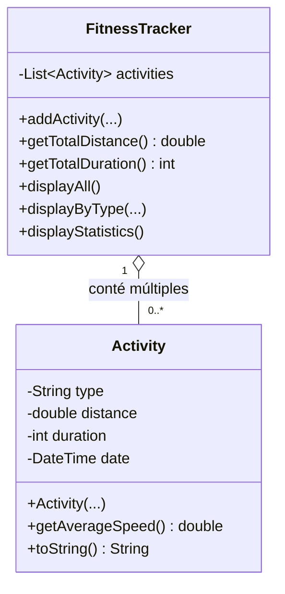

# 🏃 Introducció a la Programació Orientada a Objectes

## 📚 Objectius de la lliçó

En aquesta lliçó aprendràs:

- Comprendre les limitacions de la programació procedural
- Identificar males pràctiques en codi procedural
- Aplicar els conceptes bàsics de POO
- Refactoritzar codi procedural a orientat a objectes
- Utilitzar classes, objectes i encapsulació

---

## 🎯 Context: Sistema de Seguiment d'Activitat Física

Desenvoluparem un sistema per registrar i analitzar activitats físiques com córrer, nedar o fer ciclisme. Aquest tipus de sistema és similar al que utilitzen aplicacions com Strava o Fitbit.

---

## 📝 Part 1: Programació Procedural

### Versió inicial del programa

Començarem amb una aproximació **procedural** on utilitzarem variables globals i funcions per gestionar les dades d'activitats físiques.

```dart
// Variables globals per emmagatzemar les activitats
List<String> activityTypes = [];
List<double> distances = [];
List<int> durations = []; // en minuts
List<DateTime> dates = [];

void main() {
  // Afegir algunes activitats
  addActivity('Córrer', 5.2, 32, DateTime(2024, 11, 15));
  addActivity('Nedar', 1.5, 45, DateTime(2024, 11, 16));
  addActivity('Ciclisme', 20.0, 60, DateTime(2024, 11, 16));
  
  // Mostrar totes les activitats
  print('=== ACTIVITATS REGISTRADES ===');
  displayAllActivities();
  
  print('\n=== ESTADÍSTIQUES ===');
  displayStatistics();
  
  print('\n=== ACTIVITATS DE CÓRRER ===');
  displayActivitiesByType('Córrer');
}

// Afegir una nova activitat
void addActivity(String type, double distance, int duration, DateTime date) {
  activityTypes.add(type);
  distances.add(distance);
  durations.add(duration);
  dates.add(date);
  print('✓ Activitat afegida: $type - $distance km');
}

// Mostrar totes les activitats
void displayAllActivities() {
  for (int i = 0; i < activityTypes.length; i++) {
    print('${i + 1}. ${activityTypes[i]} - ${distances[i]} km - '
          '${durations[i]} min - ${dates[i].toString().split(' ')[0]}');
  }
}

// Calcular distància total
double getTotalDistance() {
  double total = 0;
  for (int i = 0; i < distances.length; i++) {
    total += distances[i];
  }
  return total;
}

// Calcular temps total
int getTotalDuration() {
  int total = 0;
  for (int i = 0; i < durations.length; i++) {
    total += durations[i];
  }
  return total;
}

// Calcular velocitat mitjana d'una activitat
double getAverageSpeed(int index) {
  if (durations[index] == 0) return 0;
  double hours = durations[index] / 60;
  return distances[index] / hours;
}

// Mostrar estadístiques generals
void displayStatistics() {
  print('Total d\'activitats: ${activityTypes.length}');
  print('Distància total: ${getTotalDistance().toStringAsFixed(2)} km');
  print('Temps total: ${getTotalDuration()} min');
  
  if (activityTypes.isNotEmpty) {
    double avgDistance = getTotalDistance() / activityTypes.length;
    print('Distància mitjana: ${avgDistance.toStringAsFixed(2)} km');
  }
}

// Mostrar activitats d'un tipus específic
void displayActivitiesByType(String type) {
  bool found = false;
  for (int i = 0; i < activityTypes.length; i++) {
    if (activityTypes[i] == type) {
      print('${activityTypes[i]} - ${distances[i]} km - '
            '${durations[i]} min - Velocitat: ${getAverageSpeed(i).toStringAsFixed(2)} km/h');
      found = true;
    }
  }
  
  if (!found) {
    print('No s\'han trobat activitats de tipus: $type');
  }
}
```

!!! example "Sortida del programa"
    ```
    ✓ Activitat afegida: Córrer - 5.2 km
    ✓ Activitat afegida: Nedar - 1.5 km
    ✓ Activitat afegida: Ciclisme - 20.0 km
    === ACTIVITATS REGISTRADES ===
    1. Córrer - 5.2 km - 32 min - 2024-11-15
    2. Nedar - 1.5 km - 45 min - 2024-11-16
    3. Ciclisme - 20.0 km - 60 min - 2024-11-16
    
    === ESTADÍSTIQUES ===
    Total d'activitats: 3
    Distància total: 26.70 km
    Temps total: 137 min
    Distància mitjana: 8.90 km
    
    === ACTIVITATS DE CÓRRER ===
    Córrer - 5.2 km - 32 min - Velocitat: 9.75 km/h
    ```

---

## ⚠️ Part 2: Problemes i Limitacions de la Programació Procedural

### 🔴 Problema 1: Variables Globals i Acoblament Fort

```dart
// Totes aquestes variables estan exposades globalment
List<String> activityTypes = [];
List<double> distances = [];
List<int> durations = [];
List<DateTime> dates = [];
```

**Problemes:**

- Qualsevol part del codi pot modificar aquestes variables
- No hi ha control sobre la validació de dades
- Risc d'inconsistències entre llistes (diferents longituds)
- Dificultat per mantenir la integritat de les dades

!!! danger "Exemple de problema"
    ```dart
    // Algú podria fer això per error:
    activityTypes.add('Córrer');
    distances.add(5.0);
    // Oblida afegir durations i dates!
    // Ara les llistes tenen longituds diferents → errors!
    ```

### 🔴 Problema 2: Dades Relacionades Disperses

Les dades d'una mateixa activitat estan **separades** en diferents llistes:

```dart
activityTypes[0] = 'Córrer'
distances[0]     = 5.2
durations[0]     = 32
dates[0]         = DateTime(2024, 11, 15)
```

**Problemes:**

- Difícil de mantenir la relació entre dades
- Propens a errors si s'insereixen/eliminen elements
- No hi ha garantia que els índexs coincideixin

### 🔴 Problema 3: Manca d'Encapsulació

```dart
void addActivity(String type, double distance, int duration, DateTime date) {
  // No hi ha validació!
  activityTypes.add(type);
  distances.add(distance);
  durations.add(duration);
  dates.add(date);
}
```

**Problemes:**

- No es validen les dades abans d'afegir-les
- Es podrien afegir distàncies negatives
- Es podrien afegir durations de 0 minuts
- No hi ha control sobre tipus d'activitat vàlids

!!! warning "Males pràctiques detectades"
    ```dart
    // Tot això seria vàlid però incorrecte:
    addActivity('', -5.0, -10, DateTime(2025, 1, 1)); // ❌
    addActivity('XYZ', 0, 0, DateTime.now()); // ❌
    
    // Modificació directa sense control:
    distances[0] = -100; // ❌ No hauria de ser possible!
    ```

### 🔴 Problema 4: Funcions amb Molt Acoblament

```dart
double getAverageSpeed(int index) {
  if (durations[index] == 0) return 0;
  double hours = durations[index] / 60;
  return distances[index] / hours;
}
```

**Problemes:**

- La funció depèn de variables globals
- Cal passar un índex (risc d'errors)
- Difícil de testejar de forma aïllada
- No és reutilitzable en altres contexts

### 🔴 Problema 5: Codi Repetitiu

```dart
double getTotalDistance() {
  double total = 0;
  for (int i = 0; i < distances.length; i++) {
    total += distances[i];
  }
  return total;
}

int getTotalDuration() {
  int total = 0;
  for (int i = 0; i < durations.length; i++) {
    total += durations[i];
  }
  return total;
}
```

**Problemes:**

- Codi duplicat (patrón similar per cada càlcul)
- Difícil de mantenir i actualitzar
- Més línies de codi del necessari

---

## ✅ Part 3: Solució amb Programació Orientada a Objectes

### 🎓 Conceptes Clau de POO

!!! info "Classes i Objectes"
    - **Classe**: Un pla o plantilla que defineix les propietats i comportaments d'un tipus d'entitat
    - **Objecte**: Una instància concreta d'una classe amb valors específics
    
    **Analogia:** Una classe és com un plànol d'una casa (plantilla), i un objecte és una casa real construïda amb aquest plànol.

!!! info "Encapsulació"
    Agrupar dades i funcions relacionades dins d'una mateixa unitat (classe) i controlar l'accés a aquestes dades.
    
    **Beneficis:**
    
    - Protecció de dades
    - Validació centralitzada
    - Canvis interns sense afectar l'exterior

### 🏗️ Disseny de Classes

Per al nostre sistema de fitness tracking, crearem dues classes principals:

1. **`Activity`**: Representa una activitat física individual
2. **`FitnessTracker`**: Gestiona el conjunt d'activitats

#### Diagrama de Classes



---

## 💻 Part 4: Implementació amb POO

### Classe Activity

```dart
class Activity {
  // Propietats privades (encapsulació)
  String _type;
  double _distance;
  int _duration;
  DateTime _date;
  
  // Constructor amb validació
  Activity(this._type, this._distance, this._duration, this._date) {
    _validateType(_type);
    _validateDistance(_distance);
    _validateDuration(_duration);
  }
  
  // Getters per accedir a les propietats
  String get type => _type;
  double get distance => _distance;
  int get duration => _duration;
  DateTime get date => _date;
  
  // Mètodes de validació privats
  void _validateType(String type) {
    if (type.trim().isEmpty) {
      throw ArgumentError('El tipus d\'activitat no pot estar buit');
    }
  }
  
  void _validateDistance(double distance) {
    if (distance <= 0) {
      throw ArgumentError('La distància ha de ser positiva');
    }
  }
  
  void _validateDuration(int duration) {
    if (duration <= 0) {
      throw ArgumentError('La duració ha de ser positiva');
    }
  }
  
  // Mètode per calcular la velocitat mitjana
  double getAverageSpeed() {
    double hours = _duration / 60;
    return _distance / hours;
  }
  
  // Mètode per obtenir una representació textual
  @override
  String toString() {
    return '$_type - $_distance km - $_duration min - '
           '${_date.toString().split(' ')[0]} - '
           'Velocitat: ${getAverageSpeed().toStringAsFixed(2)} km/h';
  }
}
```

!!! tip "Avantatges de la Classe Activity"
    ✅ **Encapsulació**: Les dades estan protegides amb `_` (privades)
    
    ✅ **Validació**: Totes les dades es validen al constructor
    
    ✅ **Cohesió**: Totes les dades d'una activitat estan juntes
    
    ✅ **Mètodes associats**: `getAverageSpeed()` està on pertoca

### Classe FitnessTracker

```dart
class FitnessTracker {
  // Llista privada d'activitats
  final List<Activity> _activities = [];
  
  // Getter per obtenir una còpia de les activitats (només lectura)
  List<Activity> get activities => List.unmodifiable(_activities);
  
  // Afegir una nova activitat
  void addActivity(String type, double distance, int duration, DateTime date) {
    try {
      Activity activity = Activity(type, distance, duration, date);
      _activities.add(activity);
      print('✓ Activitat afegida: $type - $distance km');
    } catch (e) {
      print('✗ Error: ${e.toString()}');
    }
  }
  
  // Calcular distància total
  double getTotalDistance() {
    return _activities.fold(0.0, (sum, activity) => sum + activity.distance);
  }
  
  // Calcular duració total
  int getTotalDuration() {
    return _activities.fold(0, (sum, activity) => sum + activity.duration);
  }
  
  // Obtenir nombre d'activitats
  int getActivityCount() {
    return _activities.length;
  }
  
  // Calcular distància mitjana
  double getAverageDistance() {
    if (_activities.isEmpty) return 0.0;
    return getTotalDistance() / _activities.length;
  }
  
  // Mostrar totes les activitats
  void displayAllActivities() {
    if (_activities.isEmpty) {
      print('No hi ha activitats registrades');
      return;
    }
    
    for (int i = 0; i < _activities.length; i++) {
      print('${i + 1}. ${_activities[i]}');
    }
  }
  
  // Mostrar activitats per tipus
  void displayActivitiesByType(String type) {
    List<Activity> filtered = _activities
        .where((activity) => activity.type.toLowerCase() == type.toLowerCase())
        .toList();
    
    if (filtered.isEmpty) {
      print('No s\'han trobat activitats de tipus: $type');
      return;
    }
    
    for (Activity activity in filtered) {
      print(activity);
    }
  }
  
  // Mostrar estadístiques
  void displayStatistics() {
    print('Total d\'activitats: ${getActivityCount()}');
    print('Distància total: ${getTotalDistance().toStringAsFixed(2)} km');
    print('Temps total: ${getTotalDuration()} min');
    
    if (_activities.isNotEmpty) {
      print('Distància mitjana: ${getAverageDistance().toStringAsFixed(2)} km');
    }
  }
  
  // Obtenir activitats per tipus (retorna llista)
  List<Activity> getActivitiesByType(String type) {
    return _activities
        .where((activity) => activity.type.toLowerCase() == type.toLowerCase())
        .toList();
  }
}
```

### Programa Principal Refactoritzat

```dart
void main() {
  // Crear una instància del tracker
  FitnessTracker tracker = FitnessTracker();
  
  // Afegir activitats
  tracker.addActivity('Córrer', 5.2, 32, DateTime(2024, 11, 15));
  tracker.addActivity('Nedar', 1.5, 45, DateTime(2024, 11, 16));
  tracker.addActivity('Ciclisme', 20.0, 60, DateTime(2024, 11, 16));
  
  // Intentar afegir activitats invàlides (es capturarà l'error)
  print('\n--- Provant validacions ---');
  tracker.addActivity('', 5.0, 30, DateTime.now()); // Error: tipus buit
  tracker.addActivity('Córrer', -5.0, 30, DateTime.now()); // Error: distància negativa
  tracker.addActivity('Córrer', 5.0, 0, DateTime.now()); // Error: duració 0
  
  // Mostrar totes les activitats
  print('\n=== ACTIVITATS REGISTRADES ===');
  tracker.displayAllActivities();
  
  // Mostrar estadístiques
  print('\n=== ESTADÍSTIQUES ===');
  tracker.displayStatistics();
  
  // Filtrar per tipus
  print('\n=== ACTIVITATS DE CÓRRER ===');
  tracker.displayActivitiesByType('Córrer');
  
  // Utilitzar els objectes directament
  print('\n=== ANÀLISI DETALLADA ===');
  List<Activity> runningActivities = tracker.getActivitiesByType('Córrer');
  for (Activity activity in runningActivities) {
    print('Activitat: ${activity.type}');
    print('  - Distància: ${activity.distance} km');
    print('  - Duració: ${activity.duration} min');
    print('  - Velocitat: ${activity.getAverageSpeed().toStringAsFixed(2)} km/h');
  }
}
```

!!! success "Sortida del programa POO"
    ```
    ✓ Activitat afegida: Córrer - 5.2 km
    ✓ Activitat afegida: Nedar - 1.5 km
    ✓ Activitat afegida: Ciclisme - 20.0 km
    
    --- Provant validacions ---
    ✗ Error: Invalid argument(s): El tipus d'activitat no pot estar buit
    ✗ Error: Invalid argument(s): La distància ha de ser positiva
    ✗ Error: Invalid argument(s): La duració ha de ser positiva
    
    === ACTIVITATS REGISTRADES ===
    1. Córrer - 5.2 km - 32 min - 2024-11-15 - Velocitat: 9.75 km/h
    2. Nedar - 1.5 km - 45 min - 2024-11-16 - Velocitat: 2.00 km/h
    3. Ciclisme - 20.0 km - 60 min - 2024-11-16 - Velocitat: 20.00 km/h
    
    === ESTADÍSTIQUES ===
    Total d'activitats: 3
    Distància total: 26.70 km
    Temps total: 137 min
    Distància mitjana: 8.90 km
    
    === ACTIVITATS DE CÓRRER ===
    Córrer - 5.2 km - 32 min - 2024-11-15 - Velocitat: 9.75 km/h
    ```

---

## 📊 Part 5: Comparació Final

### Taula Comparativa

| Aspecte | Programació Procedural | Programació Orientada a Objectes |
|---------|------------------------|-----------------------------------|
| **Organització de dades** | Variables globals disperses (4 llistes) | Objectes cohesionats (classe `Activity`) |
| **Validació** | ❌ Cap validació | ✅ Validació al constructor |
| **Encapsulació** | ❌ Dades públiques | ✅ Dades privades amb getters |
| **Mantenibilitat** | ⚠️ Difícil (variables globals) | ✅ Fàcil (responsabilitats clares) |
| **Errors potencials** | ⚠️ Llistes desincronitzades | ✅ Impossible per disseny |
| **Reutilització** | ⚠️ Difícil | ✅ Classes reutilitzables |
| **Testabilitat** | ⚠️ Difícil testejar funcions | ✅ Fàcil testejar classes |
| **Escalabilitat** | ⚠️ Difícil afegir funcionalitats | ✅ Fàcil estendre classes |

### Avantatges de la versió POO

!!! success "Beneficis obtinguts"
    **1. Encapsulació i Protecció de Dades**
    
    - Les dades són privades (`_variable`)
    - Accés controlat mitjançant getters
    - Validació automàtica al constructor
    
    **2. Cohesió i Organització**
    
    - Dades relacionades agrupades en un objecte
    - Mètodes associats a les dades que gestionen
    - Codi més llegible i mantenible
    
    **3. Reutilització**
    
    - Les classes es poden utilitzar en altres projectes
    - Menys codi duplicat
    - Mètodes ben definits i documentats
    
    **4. Flexibilitat i Extensibilitat**
    
    - Fàcil afegir nous tipus d'activitats
    - Fàcil afegir nous càlculs o estadístiques
    - Possible heretar i especialitzar classes

---

## 🎯 Exercicis Pràctics

### Exercici 1: Afegir Calories

Modifica la classe `Activity` per incloure les calories cremades en cada activitat.

??? tip "Pista"
    - Afegeix una propietat privada `_calories`
    - Actualitza el constructor
    - Afegeix validació
    - Actualitza el mètode `toString()`

??? example "Solució"
    ```dart
    class Activity {
      String _type;
      double _distance;
      int _duration;
      DateTime _date;
      int _calories; // Nova propietat
      
      Activity(this._type, this._distance, this._duration, this._date, this._calories) {
        _validateType(_type);
        _validateDistance(_distance);
        _validateDuration(_duration);
        _validateCalories(_calories);
      }
      
      int get calories => _calories;
      
      void _validateCalories(int calories) {
        if (calories < 0) {
          throw ArgumentError('Les calories no poden ser negatives');
        }
      }
      
      @override
      String toString() {
        return '$_type - $_distance km - $_duration min - '
               '${_date.toString().split(' ')[0]} - '
               'Velocitat: ${getAverageSpeed().toStringAsFixed(2)} km/h - '
               'Calories: $_calories kcal';
      }
    }
    ```

### Exercici 2: Calcular Calories Totals

Afegeix un mètode a `FitnessTracker` per calcular el total de calories cremades.

??? example "Solució"
    ```dart
    int getTotalCalories() {
      return _activities.fold(0, (sum, activity) => sum + activity.calories);
    }
    ```

### Exercici 3: Activitat més Llarga

Crea un mètode que retorni l'activitat amb més distància recorreguda.

??? example "Solució"
    ```dart
    Activity? getLongestActivity() {
      if (_activities.isEmpty) return null;
      
      Activity longest = _activities[0];
      for (Activity activity in _activities) {
        if (activity.distance > longest.distance) {
          longest = activity;
        }
      }
      return longest;
    }
    ```

### Exercici 4: Activitats per Setmana

Crea un mètode que mostri les activitats d'una setmana específica.

??? tip "Pista"
    Utilitza `activity.date` per filtrar activitats dins d'un rang de dates.

??? example "Solució"
    ```dart
    List<Activity> getActivitiesByWeek(DateTime startDate) {
      DateTime endDate = startDate.add(Duration(days: 7));
      
      return _activities.where((activity) {
        return activity.date.isAfter(startDate) && 
               activity.date.isBefore(endDate);
      }).toList();
    }
    
    void displayWeeklyActivities(DateTime startDate) {
      List<Activity> weekActivities = getActivitiesByWeek(startDate);
      
      print('Activitats de la setmana ${startDate.toString().split(' ')[0]}:');
      if (weekActivities.isEmpty) {
        print('  No hi ha activitats aquesta setmana');
        return;
      }
      
      for (Activity activity in weekActivities) {
        print('  - ${activity}');
      }
    }
    ```

---

## 📝 Resum de Conceptes

!!! abstract "Què hem après"
    **Programació Procedural:**
    
    - Utilitza variables globals
    - Funcions independents
    - Dades i funcions separades
    - Més propensa a errors
    
    **Programació Orientada a Objectes:**
    
    - **Classe**: Plantilla que defineix propietats i mètodes
    - **Objecte**: Instància d'una classe
    - **Encapsulació**: Protegir dades i controlar accés
    - **Cohesió**: Agrupar dades i funcions relacionades
    - **Abstracció**: Amagar complexitat interna
    
    **Beneficis de POO:**
    
    - Codi més organitzat i llegible
    - Menys errors i bugs
    - Més fàcil de mantenir i estendre
    - Millor reutilització del codi

---

## 🚀 Pas Següent

En la propera lliçó explorarem:

- **Herència**: Crear classes especialitzades
- **Polimorfisme**: Diferents comportaments per al mateix mètode
- **Classes abstractes**: Plantilles per a altres classes
- **Interfícies**: Contractes que les classes han de complir

---

## 📚 Recursos Addicionals

- [Dart Language Tour - Classes](https://dart.dev/guides/language/language-tour#classes)
- [Effective Dart: Design](https://dart.dev/guides/language/effective-dart/design)
- [MIT OpenCourseWare - Introduction to Programming](https://ocw.mit.edu/)

---

!!! question "Preguntes d'Autoavaluació"
    1. Què és una classe i què és un objecte?
    2. Quins problemes resol l'encapsulació?
    3. Per què és millor utilitzar objectes que variables globals?
    4. Com es validen les dades en la versió POO?
    5. Què significa que una propietat sigui privada (`_propietat`)?
    6. Quins avantatges té agrupar dades i mètodes en una classe?
