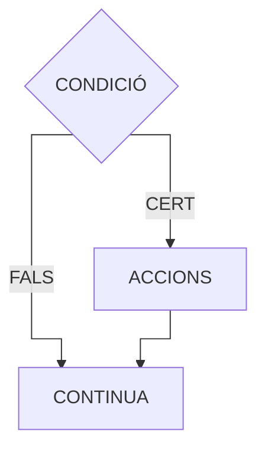

# Classe 7: Estructura Alternativa Simple (IF)

## Objectius d'aprenentatge
- Comprendre l'estructura IF
- Aplicar decisions simples
- Utilitzar blocs d'instruccions
- Resoldre problemes amb condicions

---

## 1. Què és l'Estructura IF?

!!! note "Definició"
    L'estructura **IF** permet executar un bloc de codi **només si** es compleix una condició.

### Diagrama de flux

<div style="display: flex; justify-content: center; align-items: center;">
  <div style="transform: scale(0.8);">



  </div>
</div>

---

## 2. Sintaxi de l'IF

```pseudocode
SI condició LLAVORS
    // Instruccions que s'executen si la condició és CERTA
FI_SI
```

### Exemple bàsic

```pseudocode
ALGORISME ExempleIF
VARIABLES
    edat: ENTER
    
INICI
    edat ← 20
    
    SI edat ≥ 18 LLAVORS
        ESCRIURE "Ets major d'edat"
    FI_SI
    
    ESCRIURE "Programa acabat"
FI
```

**Sortida:**
```
Ets major d'edat
Programa acabat
```

---

## 3. Condicions Simples

### Exemple 1: Número positiu

```pseudocode
ALGORISME NumeroPositiu
VARIABLES
    numero: ENTER
    
INICI
    ESCRIURE "Introdueix un número:"
    LLEGIR numero
    
    SI numero > 0 LLAVORS
        ESCRIURE "El número és positiu"
    FI_SI
FI
```

---

### Exemple 2: Nota aprovada

```pseudocode
ALGORISME NotaAprovada
VARIABLES
    nota: REAL
    
INICI
    ESCRIURE "Introdueix la nota:"
    LLEGIR nota
    
    SI nota ≥ 5.0 LLAVORS
        ESCRIURE "APROVAT!"
        ESCRIURE "Enhorabona!"
    FI_SI
FI
```

---

## 4. Múltiples Instruccions dins l'IF

!!! tip "Bloc d'instruccions"
    Podem posar **tantes instruccions com vulguem** entre `LLAVORS` i `FI_SI`.

```pseudocode
ALGORISME CompraAmbDescompte
VARIABLES
    preu: REAL
    preuFinal: REAL
    
INICI
    ESCRIURE "Preu del producte:"
    LLEGIR preu
    
    SI preu > 100.0 LLAVORS
        ESCRIURE "*** DESCOMPTE DEL 10% ***"
        preuFinal ← preu * 0.90
        ESCRIURE "Preu original:", preu, "€"
        ESCRIURE "Preu amb descompte:", preuFinal, "€"
        ESCRIURE "Estalvis:", preu - preuFinal, "€"
    FI_SI
    
    ESCRIURE "Gràcies per la teva compra!"
FI
```

---

## 5. Condicions Compostes

Podem utilitzar operadors lògics a la condició:

### Amb I (AND)

```pseudocode
ALGORISME AccesRestringit
VARIABLES
    edat: ENTER
    teCarnet: BOOLEÀ
    
INICI
    ESCRIURE "Edat:"
    LLEGIR edat
    ESCRIURE "Tens carnet? (CERT/FALS)"
    LLEGIR teCarnet
    
    SI (edat ≥ 18) I teCarnet LLAVORS
        ESCRIURE "Pots conduir!"
    FI_SI
FI
```

---

### Amb O (OR)

```pseudocode
ALGORISME DescompteEspecial
VARIABLES
    esEstudiant: BOOLEÀ
    esPensionista: BOOLEÀ
    
INICI
    ESCRIURE "Ets estudiant? (CERT/FALS)"
    LLEGIR esEstudiant
    ESCRIURE "Ets pensionista? (CERT/FALS)"
    LLEGIR esPensionista
    
    SI esEstudiant O esPensionista LLAVORS
        ESCRIURE "Tens un 20% de descompte!"
    FI_SI
FI
```

---

## 6. Exemples Pràctics Complets

### Exemple 1: Calculadora de bonificació

```pseudocode
ALGORISME BonificacioVendes
VARIABLES
    vendes: REAL
    bonificacio: REAL
    
INICI
    ESCRIURE "Total de vendes del mes:"
    LLEGIR vendes
    
    SI vendes > 10000.0 LLAVORS
        bonificacio ← vendes * 0.05
        ESCRIURE "Enhorabona!"
        ESCRIURE "Has guanyat una bonificació de:", bonificacio, "€"
    FI_SI
    
    ESCRIURE "Vendes totals:", vendes, "€"
FI
```

---

### Exemple 2: Alarma de temperatura

```pseudocode
ALGORISME AlarmaTemperatura
VARIABLES
    temperatura: REAL
    
INICI
    ESCRIURE "Temperatura actual:"
    LLEGIR temperatura
    
    SI temperatura > 38.0 LLAVORS
        ESCRIURE "*** ALERTA! ***"
        ESCRIURE "Temperatura excessiva!"
        ESCRIURE "Activant sistema de refrigeració..."
    FI_SI
    
    ESCRIURE "Temperatura registrada:", temperatura, "°C"
FI
```

---

## 💡 Activitats Pràctiques

### 🎯 Activitat 1: Traça el programa

Què mostrarà aquest programa amb les entrades indicades?

```pseudocode
ALGORISME Traça
VARIABLES
    numero: ENTER
    
INICI
    ESCRIURE "Número:"
    LLEGIR numero
    
    SI numero mod 2 = 0 LLAVORS
        ESCRIURE "És parell"
    FI_SI
    
    ESCRIURE "Fi del programa"
FI
```

Executa amb:
- a) `numero = 4`
- b) `numero = 7`

??? success "Solució"
    **a) numero = 4:**
    ```
    Número:
    4
    És parell
    Fi del programa
    ```
    
    **b) numero = 7:**
    ```
    Número:
    7
    Fi del programa
    ```

---

### 🎯 Activitat 2: Troba l'error

Aquest programa té un error de sintaxi. Troba'l i corregeix-lo:

```pseudocode
ALGORISME ErrorSintaxi
VARIABLES
    edat: ENTER
    
INICI
    LLEGIR edat
    
    SI edat ≥ 18 LLAVORS
        ESCRIURE "Ets adult"
    
    ESCRIURE "Adéu"
FI
```

??? success "Solució"
    Falta `FI_SI` després de l'ESCRIURE "Ets adult":
    
    ```pseudocode
    ALGORISME ErrorSintaxi
    VARIABLES
        edat: ENTER
        
    INICI
        LLEGIR edat
        
        SI edat ≥ 18 LLAVORS
            ESCRIURE "Ets adult"
        FI_SI
        
        ESCRIURE "Adéu"
    FI
    ```

---

### 🎯 Activitat 3: Completa el codi

```pseudocode
ALGORISME PassaDeRang
VARIABLES
    temperatura: REAL
    
INICI
    LLEGIR temperatura
    
    SI _______________ LLAVORS
        ESCRIURE "Fa molt fred!"
    FI_SI
    
    SI _______________ LLAVORS
        ESCRIURE "Fa molta calor!"
    FI_SI
FI
```

Completa per mostrar "Fa molt fred" si T < 0 i "Fa molta calor" si T > 35.

??? success "Solució"
    ```pseudocode
    SI temperatura < 0.0 LLAVORS
        ESCRIURE "Fa molt fred!"
    FI_SI
    
    SI temperatura > 35.0 LLAVORS
        ESCRIURE "Fa molta calor!"
    FI_SI
    ```

---

## 💻 Exercicis de Programació

### Exercici 1: Edat per votar

Programa que llegeixi l'edat i mostri "Pots votar" si té 18 o més anys.

??? success "Solució"
    ```pseudocode
    ALGORISME EdatPerVotar
    VARIABLES
        edat: ENTER
        
    INICI
        ESCRIURE "Quants anys tens?"
        LLEGIR edat
        
        SI edat ≥ 18 LLAVORS
            ESCRIURE "Pots votar!"
        FI_SI
    FI
    ```

---

### Exercici 2: Preu amb IVA

Si el producte val més de 100€, mostra també el preu amb IVA (21%).

??? success "Solució"
    ```pseudocode
    ALGORISME PreuAmbIVA
    VARIABLES
        preu: REAL
        preuIVA: REAL
        
    INICI
        ESCRIURE "Preu del producte:"
        LLEGIR preu
        
        SI preu > 100.0 LLAVORS
            preuIVA ← preu * 1.21
            ESCRIURE "Preu amb IVA:", preuIVA, "€"
        FI_SI
    FI
    ```

---

### Exercici 3: Divisible per 5

Programa que llegeixi un número i indiqui si és divisible per 5.

??? success "Solució"
    ```pseudocode
    ALGORISME DivisiblePer5
    VARIABLES
        numero: ENTER
        
    INICI
        ESCRIURE "Introdueix un número:"
        LLEGIR numero
        
        SI numero mod 5 = 0 LLAVORS
            ESCRIURE numero, "és divisible per 5"
        FI_SI
    FI
    ```

---

### Exercici 4: Password correcta

Llegeix una contrasenya i mostra "Accés permès" si és "Secreta123".

??? success "Solució"
    ```pseudocode
    ALGORISME ValidarPassword
    VARIABLES
        contrasenya: TEXT
        
    INICI
        ESCRIURE "Introdueix la contrasenya:"
        LLEGIR contrasenya
        
        SI contrasenya = "Secreta123" LLAVORS
            ESCRIURE "Accés permès"
            ESCRIURE "Benvingut al sistema!"
        FI_SI
    FI
    ```

---

### Exercici 5: Velocitat excessiva

Llegeix una velocitat. Si supera 120 km/h, mostra "Multa!" i l'import (100€).

??? success "Solució"
    ```pseudocode
    ALGORISME ControlVelocitat
    VARIABLES
        velocitat: ENTER
        
    INICI
        ESCRIURE "Velocitat detectada (km/h):"
        LLEGIR velocitat
        
        SI velocitat > 120 LLAVORS
            ESCRIURE "*** MULTA! ***"
            ESCRIURE "Has superat el límit"
            ESCRIURE "Import: 100€"
        FI_SI
    FI
    ```

---

## 🏠 Deures

1. **Nota de tall:** Llegeix una nota. Si és 7 o més, mostra "Excel·lent!".

2. **Envio gratuït:** Si la compra supera 50€, mostra "Envio gratuït!".

3. **Alarma pluja:** Llegeix humitat. Si supera 80%, mostra "Prepara el paraigua".

4. **Majoria d'edat en dos països:** Llegeix edat. Si ≥18, pot conduir a Espanya. Si ≥21, pot conduir als USA.

5. **Número negatiu i parell:** Mostra "Número negatiu parell" només si compleix ambdues condicions.

---

## 📝 Resum

!!! summary "Conceptes clau"
    - ✅ IF executa codi només si la condició és CERT
    - ✅ Sintaxi: `SI condició LLAVORS ... FI_SI`
    - ✅ Podem posar múltiples instruccions dins l'IF
    - ✅ Les condicions poden usar operadors lògics (I, O, NO)

---

## 🤔 Autoavaluació

!!! question "Pregunta 1"
    Quantes vegades s'executa el bloc dins l'IF si la condició és FALS?
    
    a) 0 vegades  
    b) 1 vegada  
    c) 2 vegades  
    d) Sempre

??? success "Resposta"
    **a) 0 vegades**  
    Si la condició és FALS, el bloc no s'executa

!!! question "Pregunta 2"
    Quin és l'error en aquest codi?
    ```
    SI x > 5
        ESCRIURE "Major"
    FI_SI
    ```
    
    a) Falta LLAVORS  
    b) x no està declarada  
    c) Falta punt i coma  
    d) No hi ha error

??? success "Resposta"
    **a) Falta LLAVORS**  
    Hauria de ser `SI x > 5 LLAVORS`
